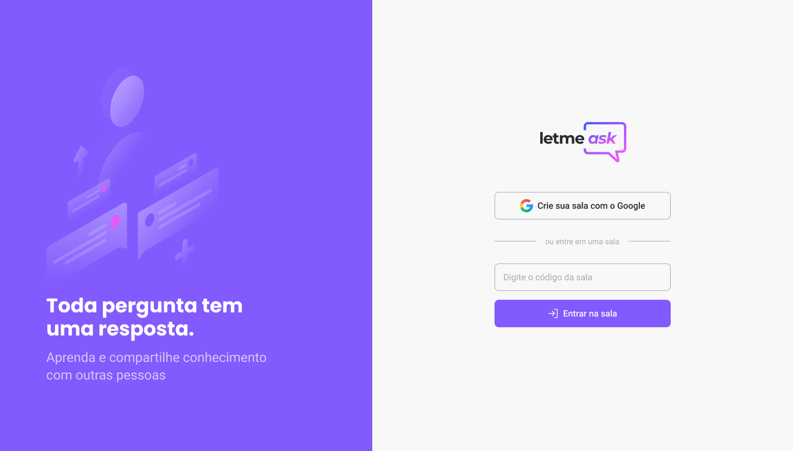

<h1 align="center">❓ Letmeask ❓</h1>
<h2 align="center">Uma aplicação de perguntas e respostas que visa unir a comunidade para para o um mesmo propósito que é aprender. </h2>

<br>
<br>
<br>
  


## Tecnologias

- [x] ReactJS
- [x] FireBase


<br>

## Homepage


````ts
interface {
  texto: string,
}


function myComponent() {
  return(
    <>
      <h1>Exemplo de Componente</h1>
    </>
  )
}

````
## Exemplo de Uso do Componente
<p>Esse é componente visa trazer facilidade no uso de bla bla bla. </p>
 
````ts
  <MyComponent texto=""/>
````


